# Adaptive MPM: Complete Flowchart and Execution Guide

## Purpose

This is a condensed, flowchart-centered explanation of the adaptive 2-D Material Point Method solver. It focuses on:

- what happens;
- the exact execution order;
- how particles and grid levels communicate;
- when dynamic regridding occurs;
- how refinement targets are chosen;
- how particles split and merge;
- which quantities are conserved;
- which implementation limitations matter in a technical report.

For the full source-by-source mathematical audit, see [`ALGORITHM_MAP.md`](ALGORITHM_MAP.md).

> **Important terminology:** `QuadtreeGrid2D` is implemented as nested dense Cartesian patches. It is not a pointer-based recursive quadtree, a Morton-coded tree, or a sparse tree structure.

---

# 1. Whole-system flowchart

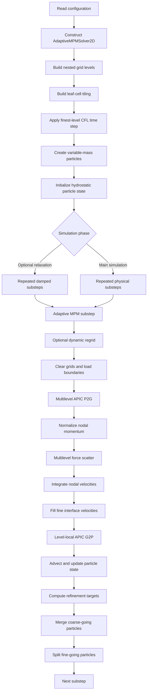

The executed substep is defined in [`solver/adaptive_engine.py:375-399`](solver/adaptive_engine.py#L375-L399).

---

# 2. Where the state lives

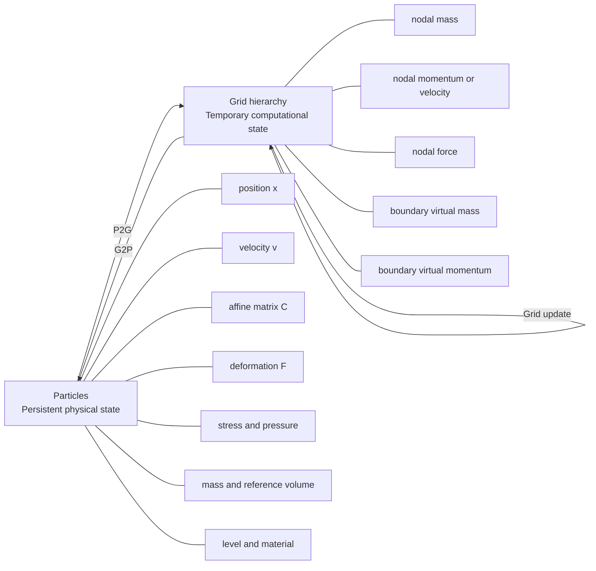

## Persistent particle fields

| Field | Meaning |
|---|---|
| `x[p]` | position $x_p$ |
| `v[p]` | velocity $v_p$ |
| `C[p]` | APIC affine velocity matrix $C_p$ |
| `F[p]` | deformation gradient $F_p$ |
| `stress[p]` | Cauchy stress $σ_p$ |
| `pressure[p]` | scalar diagnostic pressure $P_p$ |
| `mass[p]` | physical particle mass $m_p$ |
| `volume0[p]` | reference particle volume $V_p^0$ |
| `level[p]` | current AMR level $ℓ_p$ |
| `gradient_level[p]` | gradient-based target level |
| `material[p]` | material identifier |
| `Jp[p]` | benchmark plastic-volume state |

The adaptive particle fields use `f64`; see [`core/adaptive_particles.py:13-45`](core/adaptive_particles.py#L13-L45).

## Temporary grid fields

Each level has independent dense fields for:

- mass $m_I^ℓ$;
- momentum before normalization and velocity afterward;
- force $f_I^ℓ$;
- old velocity;
- axis-dependent boundary mass;
- axis-dependent boundary momentum.

These fields are cleared every substep. See [`core/quadtree_grid.py:116-135`](core/quadtree_grid.py#L116-L135) and [`core/quadtree_grid.py:651-660`](core/quadtree_grid.py#L651-L660).

---

# 3. Initialization flowchart

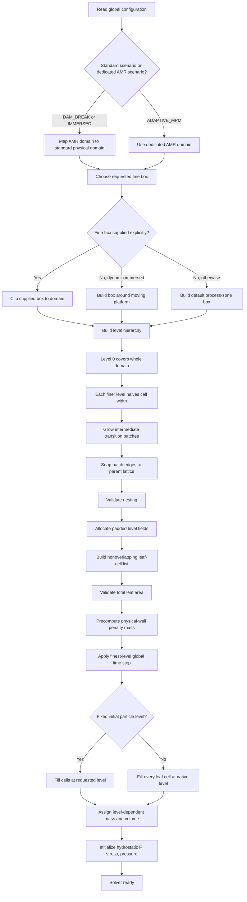

## 3.1 Scenario normalization

When adaptive MPM is selected through `DAM_BREAK` or `IMMERSED`, the constructor maps the AMR domain and fluid bounds onto the standard physical domain. For `IMMERSED`, it also centers the fine region around the platform. See [`solver/adaptive_engine.py:31-52`](solver/adaptive_engine.py#L31-L52).

## 3.2 Level geometry

For maximum level $L$:

$$
h_ℓ = h_0 / 2^ℓ,    ℓ = 0,...,L
$$

Level zero covers the complete domain. Every finer level covers a nested rectangular patch.

At level $ℓ > 0$, the requested fine box is expanded by

$$
g_ℓ = (L - ℓ) N_{buffer} h_{ℓ-1}
$$

before being snapped outward to the parent lattice. Patch bounds are clipped to the domain and checked to remain inside the parent. See [`core/quadtree_grid.py:554-592`](core/quadtree_grid.py#L554-L592).

## 3.3 Leaf-cell construction

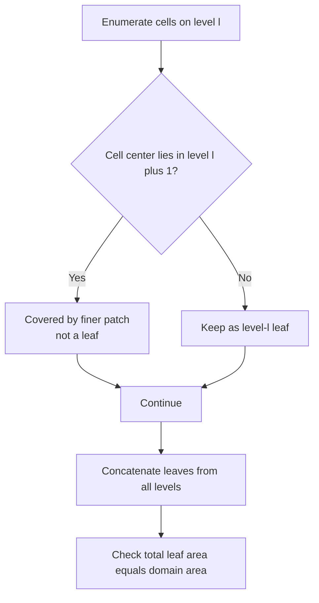

The leaf list is a nonoverlapping initial tiling. It is used for particle placement and visualization. Dynamic patch motion later updates runtime regions but does not rebuild this leaf list. See [`core/quadtree_grid.py:594-631`](core/quadtree_grid.py#L594-L631).

## 3.4 Initial particle mass and volume

At level $ℓ$, with $n_{ppc}$ particles per cell direction:

$$
V_p^0 = h_ℓ^2 / n_{ppc}^2
$$

$$
m_p = ρ_0 V_p^0
$$

Particles are centered in equal subcells. See [`core/adaptive_particles.py:89-145`](core/adaptive_particles.py#L89-L145).

## 3.5 Hydrostatic initialization

For depth $d_p$ below the initial free surface:

$$
P_p^0 = ρ_0 g d_p
$$

$$
K = ρ_0 c_0^2
$$

$$
J_p^0 = 1 / (1 + P_p^0 / K)
$$

$$
F_p^0 = diag(1, J_p^0),    σ_p^0 = -P_p^0 I
$$

See [`core/adaptive_particles.py:147-160`](core/adaptive_particles.py#L147-L160).

## 3.6 Time step

A single global time step is controlled by the finest level:

$$
Δt_{fine} = CFL   h_L / (c_0 + V_{max})
$$

The step is adjusted so an integer number of substeps fills one output frame. There is no level subcycling. See [`solver/adaptive_engine.py:53-63`](solver/adaptive_engine.py#L53-L63).

---

# 4. Master adaptive substep

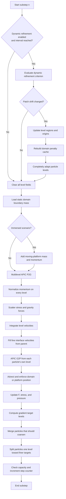

## Stage table

| Stage | Input | Operation | Output |
|---|---|---|---|
| Dynamic regrid | time and particle state | translate nested patches | current hierarchy geometry |
| Grid clear | old temporary grid | zero all working fields | empty grid hierarchy |
| Boundary setup | cached wall stencils | load virtual mass and momentum | boundary-weighted nodes |
| P2G | persistent particles | scatter APIC mass and momentum | nodal momentum |
| Normalization | fluid and boundary data | divide by effective mass | nodal velocity |
| Force scatter | stress, mass, gravity | scatter internal and external forces | nodal force |
| Grid update | velocity and force | explicit acceleration and damping | updated velocity |
| Interface fill | parent velocity | overwrite fine ghost band | coupled fine velocity |
| G2P | updated own-level grid | gather velocity and affine field | new particle kinematics |
| Constitutive update | $F$, $C$, and local $h$ | weakly compressible water model | stress and pressure |
| Adaptation | target and current levels | merge, then split | new particle population |

---

# 5. Multilevel APIC P2G

## 5.1 Transfer decision

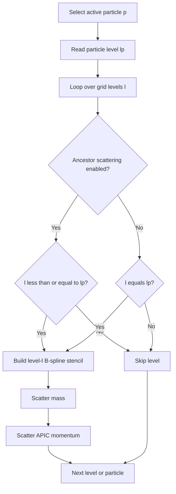

By default, a level-$ℓ_p$ particle scatters to its own level and every ancestor from level zero through $ℓ_p$. See [`solver/adaptive_engine.py:97-124`](solver/adaptive_engine.py#L97-L124).

## 5.2 Mass and momentum

For particle $p$ and node $I$ on level $ℓ$:

$$
m_I^ℓ += N_{Ip}^ℓ m_p
$$

$$
p_I^ℓ += N_{Ip}^ℓ m_p [v_p + C_p (x_I^ℓ - x_p)]
$$

The affine term transfers a locally linear velocity field, not only translational velocity.

## 5.3 Ancestor representation

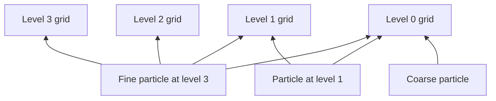

Consequences:

- particle mass is the physical global mass;
- summing nodal mass across levels would count fine particles repeatedly;
- ancestor copies let coarse levels feel fine particles;
- G2P later gathers only from the particle's own level.

---

# 6. Boundary penalty and momentum normalization

## 6.1 Boundary assembly

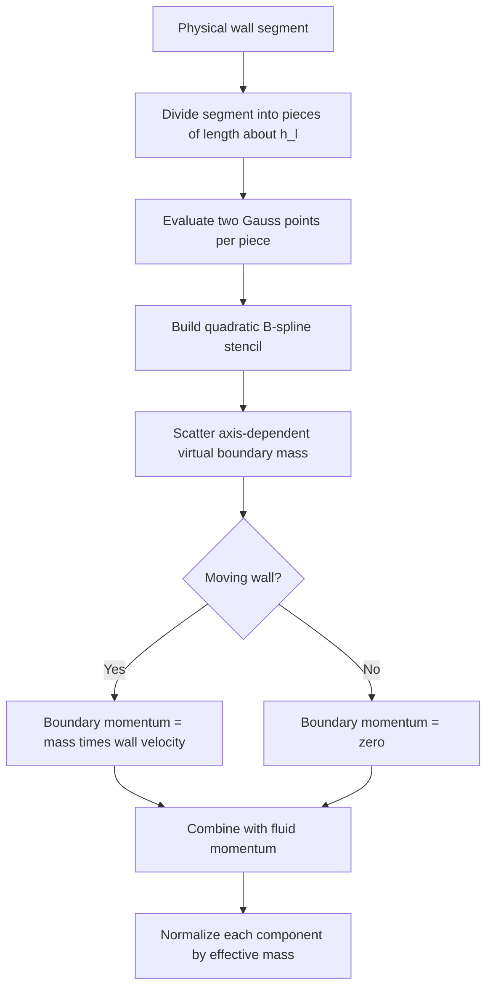

## 6.2 Penalty scale

At level $ℓ$:

$$
β_ℓ = κ_{boundary} ρ_0 h_ℓ^2
$$

Here $κ_{boundary}$ is `AMR_BOUNDARY_PENALTY_NORMAL`. Horizontal walls affect the vertical component; vertical walls affect the horizontal component. See [`core/quadtree_grid.py:151-243`](core/quadtree_grid.py#L151-L243).

## 6.3 Momentum normalization

For velocity component $a$:

$$
v_{I,a}^ℓ = (p_{I,a}^{fluid,ℓ} + p_{I,a}^{boundary,ℓ}) / (m_I^ℓ + m_{I,a}^{boundary,ℓ})
$$

See [`core/quadtree_grid.py:685-696`](core/quadtree_grid.py#L685-L696).

## 6.4 Moving-platform cache

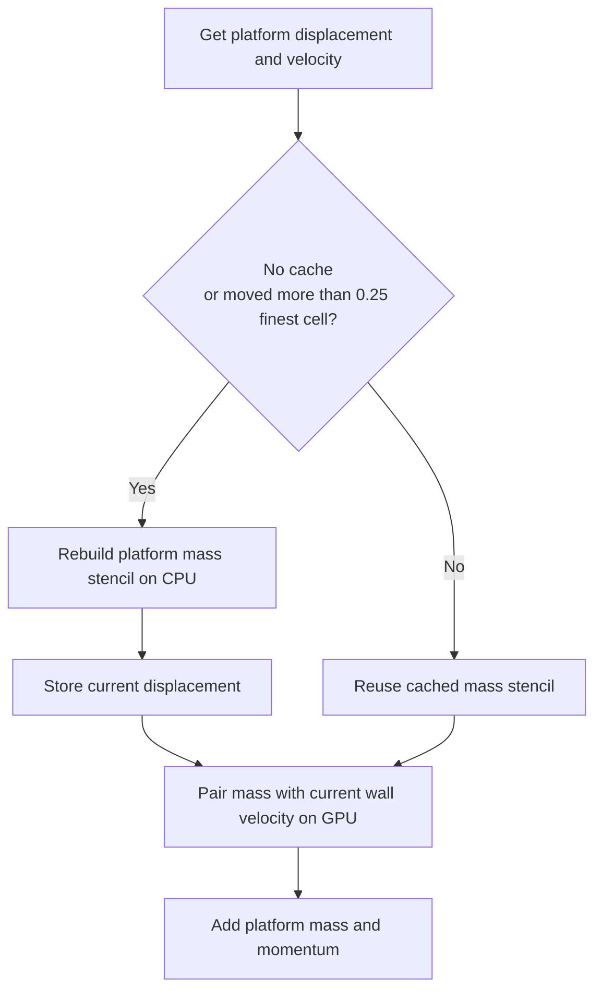

The mass stencil is updated only after meaningful geometric motion, while virtual momentum always uses the current wall velocity. See [`core/quadtree_grid.py:519-542`](core/quadtree_grid.py#L519-L542).

---

# 7. Force scatter and grid integration

## 7.1 Current particle volume

$$
J_p = det(F_p)
$$

$$
V_p = V_p^0 J_p
$$

## 7.2 Nodal force

For selected level $ℓ$:

$$
f_I^ℓ += N_{Ip}^ℓ m_p g - V_p σ_p ∇N_{Ip}^ℓ
$$

The first term is gravity. The second is the internal stress-divergence force. Particles normally scatter force to their own level and all ancestors. See [`solver/adaptive_engine.py:126-156`](solver/adaptive_engine.py#L126-L156).

## 7.3 Explicit grid update

For component $a$:

$$
v_{I,a}^{*} = v_{I,a} + Δt   f_{I,a} / (m_I + m_{I,a}^{boundary})
$$

$$
v_I^{n+1} = d   v_I^{*}
$$

where $d$ is the relaxation damping. Velocity norm is limited to

$$
V_{clamp} = 10 V_{wave,max}
$$

Here $V_{wave,max}$ is `MAX_WAVE_SPEED`. See [`solver/adaptive_engine.py:158-172`](solver/adaptive_engine.py#L158-L172).

---

# 8. Coarse-fine interface coupling

## 8.1 Interface decision

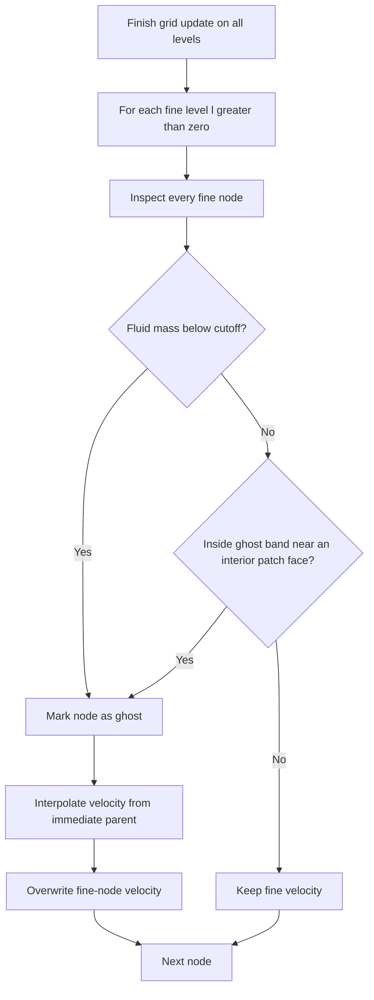

A fine node is replaced when:

1. its fluid mass is below the level cutoff; or
2. it lies within `AMR_GHOST_BAND_CELLS * h_l` of an interior patch face.

A patch face coinciding with the physical domain boundary is not treated as a coarse-fine interface. See [`core/quadtree_grid.py:721-749`](core/quadtree_grid.py#L721-L749).

## 8.2 Information flow

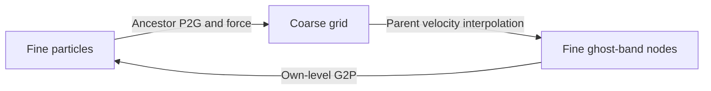

This is not a composite-grid solve. There is no flux refluxing or momentum correction after fine-node velocities are overwritten.

---

# 9. G2P and particle-state update

## 9.1 G2P flowchart

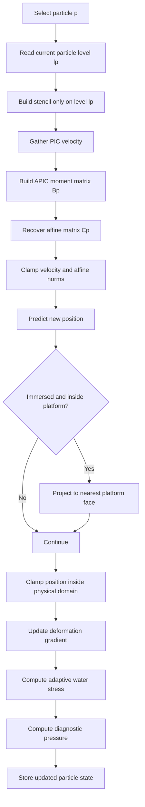

## 9.2 Velocity and affine reconstruction

A particle gathers only from its own level:

$$
v_p^{n+1} = Σ_I N_{Ip}^{ℓ_p} v_I^{ℓ_p}
$$

$$
B_p = Σ_I N_{Ip}^{ℓ_p} v_I^{ℓ_p} (x_I^{ℓ_p} - x_p)^T
$$

$$
C_p^{n+1} = (4 / h_{ℓ_p}^2) B_p
$$

See [`solver/adaptive_engine.py:203-259`](solver/adaptive_engine.py#L203-L259).

## 9.3 Advection and deformation

$$
x_p^{n+1} = x_p^n + Δt   v_p^{n+1}
$$

$$
F_p^{n+1} = (I + Δt   C_p^{n+1}) F_p^n
$$

Particles are kept `0.1 * h_l` inside the domain. In the immersed case, particles predicted inside the platform are moved to the nearest face. See [`solver/adaptive_engine.py:173-244`](solver/adaptive_engine.py#L173-L244).

## 9.4 Adaptive water model

$$
J_c = max(det(F_p), 0.96)
$$

$$
P = max[K(1 / J_c - 1), 0]
$$

$$
D = (C + C^T) / 2
$$

$$
D' = D - tr(D) I / 2
$$

During compression, `tr(D) < 0`, artificial pressure is

$$
q = -α_L ρ_0 c_0 h_ℓ tr(D) + α_Q ρ_0 [h_ℓ tr(D)]^2
$$

and stress is

$$
σ = -(P + q) I + 2 μ D'
$$

Local spacing $h_ℓ$ scales artificial viscosity. See [`physics/constitutive_model.py:72-90`](physics/constitutive_model.py#L72-L90).

Reported pressure is computed separately with `J` clamped to `0.1`, so diagnostic pressure can differ from the pressure used in stress during extreme compression.

---

# 10. Refinement-target decision

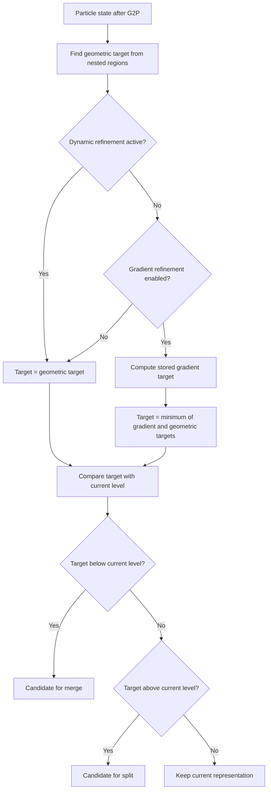

## 10.1 Geometric target

The geometric target is the deepest current patch containing the particle. See [`core/quadtree_grid.py:633-641`](core/quadtree_grid.py#L633-L641).

## 10.2 Gradient indicator

The implemented indicator is

$$
η_p = ||C_p||_F h_{ℓ_p}
$$

Starting from target zero, the kernel sets target to $k$ whenever

$$
η_p > η_0 2^k
$$

for every permitted $k$. See [`solver/adaptive_engine.py:296-324`](solver/adaptive_engine.py#L296-L324).

### Exact threshold behavior

| Target stored | Implemented threshold consequence |
|---:|---|
| 0 | $η_p > η_0$ still stores target 0 |
| 1 | requires $η_p > 2η_0$ |
| 2 | requires $η_p > 4η_0$ |

Therefore the base threshold does not promote a level-zero particle. The gradient kernel does not use pressure or `abs(J - 1)`, despite configuration comments. In particular, `AMR_GRADIENT_PRESSURE_THRESHOLD` is defined in `config.py` but is unused by the refinement algorithm.

## 10.3 Mode interaction

| Mode | Effective particle target |
|---|---|
| Static grid with gradient refinement | minimum of gradient and geometric targets |
| Static grid with gradient disabled | geometric target |
| Dynamic grid | geometric target |

Dynamic and gradient targeting are not combined in `_target_level`.

---

# 11. Dynamic regridding

## 11.1 Dynamic regrid flowchart

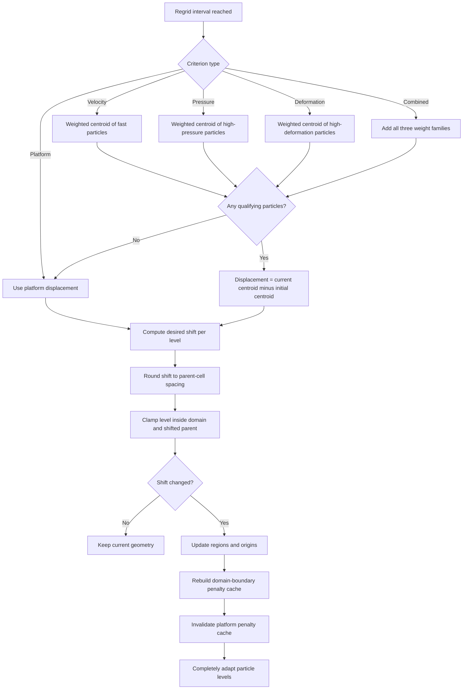

## 11.2 Physics-based weights

| Criterion | Selection | Weight |
|---|---|---|
| Velocity | speed exceeds configured fraction of estimated maximum | mass times speed |
| Pressure | pressure exceeds configured fraction of $ρ_0 c_0^2$ | mass times pressure |
| Deformation | `abs(J - 1)` exceeds threshold | mass times `abs(J - 1)` |
| Combined | union of all three | sum of all three weights |

The weighted center is

$$
c = Σ_p w_p x_p / Σ_p w_p
$$

The combined criterion adds weights with different physical dimensions, so it is not dimensionally normalized. If no particle qualifies, the code falls back to platform motion. See [`core/quadtree_grid.py:327-369`](core/quadtree_grid.py#L327-L369).

## 11.3 Shift snapping

For desired displacement $d$ and parent spacing $h$:

$$
snap(d,h) = sign(d) floor(abs(d) / h + 0.5) h
$$

Level zero remains fixed. Every finer patch is constrained to remain inside both the physical domain and its shifted parent. See [`core/quadtree_grid.py:301-320`](core/quadtree_grid.py#L301-L320).

## 11.4 Complete adaptation after motion

When geometry changes:

1. current level regions and origins are uploaded;
2. physical-boundary penalty stencils are rebuilt;
3. the platform penalty cache is invalidated;
4. particles that left fine geometry are merged (complete groups only);
5. up to `max_level` split passes move particles into newly fine geometry (each split requires all four children to fit);
6. unsupported high-level particles are demoted;
7. split capacity is checked.

See [`core/quadtree_grid.py:390-419`](core/quadtree_grid.py#L390-L419) and [`solver/adaptive_engine.py:375-380`](solver/adaptive_engine.py#L375-L380).

---

# 12. Particle splitting

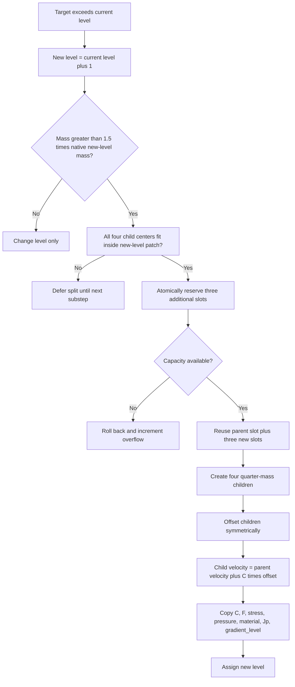

## 12.1 Native mass

$$
m_{native,ℓ} = ρ_0 (h_ℓ / n_{ppc})^2
$$

## 12.2 Child state

$$
m_c = m_p / 4,    V_c^0 = V_p^0 / 4
$$

$$
x_c = x_p + (±a, ±a),    a = 0.25 sqrt(V_p^0)
$$

$$
v_c = v_p + C_p (x_c - x_p)
$$

Symmetric offsets conserve center of mass. Quarter masses conserve mass. The affine velocity correction preserves the linear momentum represented by the parent's affine velocity field. See [`core/adaptive_particles.py:170-217`](core/adaptive_particles.py#L170-L217).

The split is **atomic at the parent level**: all four child centers must lie inside the next-level patch (`_children_fit_level`). If any child would land outside the refined region, the split is deferred to a later substep rather than producing a partial two-child group. This prevents malformed half-mass particles at refinement interfaces.

A normal substep advances at most one level. Complete adaptation after regridding performs multiple split passes.

---

# 13. Particle merging

## 13.1 Merge flowchart

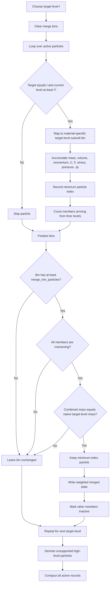

## 13.2 Merge bin identity

A bin is determined by:

- target level;
- material ID;
- target-level subcell with spacing $h_ℓ / n_{ppc}$.

The merge driver processes target levels `0` through `max_level - 1`; the finest level is not a coarsening target. See [`core/adaptive_particles.py:219-229`](core/adaptive_particles.py#L219-L229) and [`core/adaptive_particles.py:338-347`](core/adaptive_particles.py#L338-L347).

## 13.3 Merged state

$$
m_M = Σ_q m_q,    V_M^0 = Σ_q V_q^0
$$

$$
x_M = Σ_q m_q x_q / m_M
$$

$$
v_M = Σ_q m_q v_q / m_M
$$

$$
C_M = Σ_q m_q C_q / m_M
$$

$$
F_M = Σ_q V_q^0 F_q / V_M^0
$$

$$
σ_M = Σ_q V_q^0 σ_q / V_M^0
$$

Pressure and `Jp` are also volume-weighted. See [`core/adaptive_particles.py:247-296`](core/adaptive_particles.py#L247-L296).

## 13.4 Conservative merge acceptance

A merge is accepted only when **all** of the following hold:

1. **Minimum count**: the bin contains at least `AMR_MERGE_MIN_PARTICLES` particles (clamped to a minimum of 4).
2. **Uniform coarsening**: every particle in the bin is coarsening (`merge_coarsen_count == merge_count`). Mixed groups with some same-level particles are rejected.
3. **Native mass**: the combined mass equals one native target-level particle mass within tolerance (`|m - m_native| < 1e-6 * m_native`).

If any condition fails, the bin is left unchanged. Partial groups are retained rather than collapsed into malformed half-mass particles. This means some fine particles can temporarily remain at a finer level than their target until a complete sibling group reassembles.

After all target levels are processed, `_demote_unsupported_particles` checks whether any remaining high-level particle's B-spline stencil still fits inside its grid patch. If the particle has moved outside the supported region and its target is coarser, its level is demoted to the target so it can participate in the next P2G on a valid grid.

## 13.5 Conservation summary

| Property | Merge behavior |
|---|---|
| Total mass | conserved by summation |
| Linear momentum | conserved by mass-weighted velocity |
| Center of mass | conserved by mass-weighted position |
| Reference volume | conserved by summation |
| Constitutive energy | not explicitly conserved |
| Determinant of averaged $F$ | not generally conserved |
| Exact affine or angular moments | not explicitly constrained |

`AMR_MERGE_MIN_PARTICLES` is enforced: a bin with fewer than the configured minimum (clamped to at least 4) is never merged. Mixed target-level groups and non-native combined mass are also rejected.

---

# 14. One-substep state timeline

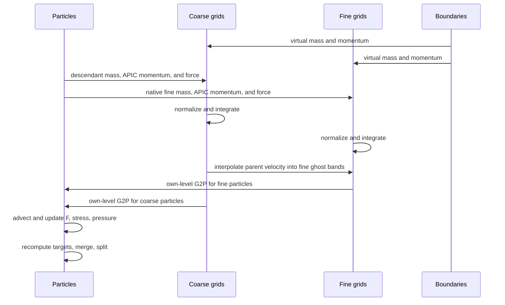

Ordering consequences:

1. boundary mass influences normalization before force integration;
2. every level is integrated before interface velocities are overwritten;
3. G2P observes the interface-filled grid;
4. gradient targets use the newly reconstructed affine matrix;
5. merge occurs before split.

---

# 15. Adaptive operating modes

## 15.1 Static geometric mode

```text
AMR_DYNAMIC_REFINEMENT = False
AMR_GRADIENT_REFINE = False
```

Particles follow the deepest fixed patch containing their position. Entering a fine patch causes split or promotion; leaving it causes merge or demotion.

## 15.2 Static gradient mode

```text
AMR_DYNAMIC_REFINEMENT = False
AMR_GRADIENT_REFINE = True
```

The grid geometry defines available levels, while particle resolution follows

```text
target = minimum of gradient target and geometric target
```

A typical benchmark gives every level full-domain coverage, starts all particles coarse, and spends particles only in high-gradient regions.

## 15.3 Dynamic geometric mode

```text
AMR_DYNAMIC_REFINEMENT = True
```

Nested patches translate according to platform or particle criteria. The effective particle target is geometric; gradient targets do not control adaptation in this mode.

---

# 16. Conservation and stability map

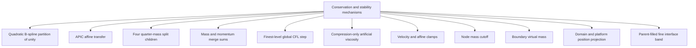

## Strong invariants

- Split conserves total particle mass by construction.
- Split is atomic: all four children must fit inside the next-level patch or the split is deferred.
- Merge conserves total particle mass and linear momentum by construction.
- Merge is conservative: only complete, uniformly coarsening, native-mass groups are merged.
- Unsupported high-level particles are demoted to their target level after merge.
- Particle mass is the global physical mass invariant.
- Initial leaf cells are validated to tile the domain by area.
- Dynamic patches are constrained to remain nested and domain-bounded.

## Qualified properties

- Single-level P2G conserves mass when the full B-spline stencil is available.
- The same physical mass is intentionally represented on multiple ancestor grids.
- Fine interface velocity overwrite is not followed by momentum refluxing.
- Merge does not explicitly preserve constitutive energy.
- Velocity and position clamps alter the unconstrained evolution when activated.

---

# 17. Important reporting caveats

1. **Nested dense patches, not a recursive tree.**
2. **One finest-level global time step; no level subcycling.**
3. **Do not sum nodal mass over levels; ancestor representations duplicate physical particles.**
4. **Coarse-fine coupling is not a conservative composite solve.**
5. **Dynamic and gradient targets are not combined; dynamic mode uses geometric targets.**
6. **Gradient adaptation uses only $||C||_F h$; pressure and `abs(J - 1)` are not part of that kernel.**
7. **Passing the base gradient threshold still stores target zero.**
8. **Conservative merge requires complete sibling groups; incomplete groups are retained, which can leave fine particles temporarily above their target level.**
9. **Dynamic motion updates runtime patches but does not rebuild initial leaf arrays.**
10. **The adaptive solver has no nodal F-bar stage.**
11. **Stress pressure clamps $J$ at `0.96`; diagnostic pressure clamps it at `0.1`.**
12. **Current particle volume uses unclamped `det(F)`.**
13. **The combined dynamic criterion adds weights with different physical units.**
14. **Particle capacity must be large enough for all requested splits.**

---

# 18. Condensed pseudocode

```text
INITIALIZATION
    map scenario settings to the adaptive domain
    create level 0 over the complete domain
    for every finer level:
        halve cell width
        grow a transition patch around the requested fine box
        snap edges to the parent lattice
        validate nesting and allocate padded fields
    build a nonoverlapping leaf-cell tiling
    precompute physical-wall virtual mass
    create particles at a fixed level or from leaf cells
    assign level-dependent mass and reference volume
    initialize hydrostatic F, stress, and pressure
    reduce global dt to the finest-level CFL limit

EACH SUBSTEP
    if dynamic regrid interval:
        evaluate platform or particle criterion
        compute desired hierarchy displacement
        snap each level shift to parent spacing
        constrain patches inside parent and domain
        if geometry changed:
            upload new regions and origins
            rebuild physical-boundary penalty mass
            merge and repeatedly split particles to geometric targets

    clear all level working fields
    load cached physical-boundary mass
    if immersed:
        add moving-platform mass and momentum

    for each particle:
        for own level and every ancestor:
            scatter B-spline mass
            scatter APIC momentum

    for each grid level:
        normalize fluid plus boundary momentum by effective mass

    for each particle:
        for own level and every ancestor:
            scatter gravity and stress force

    for every level node:
        integrate velocity with effective boundary mass
        apply damping and velocity clamp

    for every fine node:
        if low-mass or near an interior patch face:
            overwrite velocity from parent interpolation

    for every particle:
        gather velocity and APIC affine matrix from own level
        clamp velocity and affine norms
        advect position
        project from platform if needed
        clamp inside physical domain
        update F = (I + dt C) F
        compute level-aware water stress
        compute diagnostic pressure

    compute velocity-gradient targets
    merge complete coarse-going groups (min count, uniform coarsening, native mass)
    demote unsupported high-level particles
    split fine-going particles whose four children fit the next-level patch
    check split capacity
```

---

# 19. Minimal source map

| Algorithm | Source |
|---|---|
| Solver construction and complete step | [`solver/adaptive_engine.py`](solver/adaptive_engine.py) |
| Nested geometry and interface fill | [`core/quadtree_grid.py`](core/quadtree_grid.py) |
| Particle creation, split, merge | [`core/adaptive_particles.py`](core/adaptive_particles.py) |
| Adaptive water stress | [`physics/constitutive_model.py:72-90`](physics/constitutive_model.py#L72-L90) |
| AMR configuration | [`config.py:14-76`](config.py#L14-L76) |
| Penalty verification | [`verify_penalty_boundary.py`](verify_penalty_boundary.py) |
| Dynamic regrid verification | [`verify_dynamic_refinement.py`](verify_dynamic_refinement.py) |
| Merge verification | [`verify_particle_merge.py`](verify_particle_merge.py) |
| Hydrostatic diagnostic | [`verify_adaptive.py`](verify_adaptive.py) |

---

# 20. One-paragraph report summary

The adaptive solver represents the fluid with variable-mass material points and computes each substep on a hierarchy of nested Cartesian patches. Particles transfer APIC mass, momentum, stress forces, and gravity to their own level and all coarser ancestors. Each grid level is normalized and integrated independently while virtual boundary mass imposes domain and moving-platform constraints. Fine interface velocities are then replaced by interpolated parent velocities, after which particles gather only from their own level, advect, update deformation, and evaluate a level-aware weakly compressible water model. Adaptivity is performed in particle space: particles merge when their target becomes coarser and split into four children when finer resolution is required. The solver supports fixed geometric patches, velocity-gradient-driven particle resolution, and dynamically translated refinement windows, although dynamic mode uses geometric rather than gradient particle targets.
