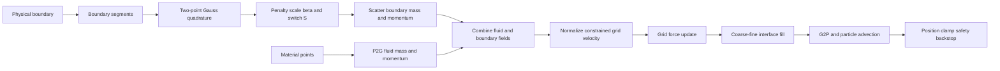

# Weak Imposition of the Non-Penetration Boundary Condition

## Horizontal algorithm flowchart

**Figure 1.** Weak imposition of the non-penetration condition in the adaptive MPM solver. Boundary quadrature generates a directional artificial mass and, for a moving wall, corresponding boundary momentum. These contributions modify grid momentum normalization and force integration. The method weakly drives the normal grid velocity toward the wall velocity. The final particle-position clamp is a separate numerical safety mechanism and is not part of the weak penalty formulation.

## Governing discrete relations

The fluid contribution obtained by particle-to-grid transfer is

\[
m^{f}_{Iij}=\sum_{p\in S_M}N_I(x_p)m_p\,\delta_{ij}.
\tag{1}
\]

Boundary quadrature adds the diagonal artificial-mass contribution

\[
m^{b}_{Iij}
=\sum_{q\in\partial\Omega_D}
N_I(x_q)\,\beta_\ell\,S_{ij}\,W_q,
\tag{2}
\]

with

\[
\beta_\ell=\kappa_{\mathrm{nor}}\rho_0 h_\ell^2,
\qquad
S=
\begin{bmatrix}
s_x&0\\
0&s_y
\end{bmatrix},
\qquad s_x,s_y\in\{0,1\}.
\tag{3}
\]

For a wall moving with velocity \(v^w\), the boundary momentum is

\[
p^b_{I,a}=m^b_{I,a}v^w_a.
\tag{4}
\]

The component-wise grid velocity is then

\[
v_{I,a}
=\frac{p^f_{I,a}+p^b_{I,a}}
       {m^f_I+m^b_{I,a}}.
\tag{5}
\]

For a stationary wall, \(p^b_{I,a}=0\). As \(m^b_{I,n}/m^f_I\) increases, the normal velocity approaches zero. For a moving wall, it approaches the wall-normal velocity:

\[
v_{I,n}-v^w_n
=\frac{m^f_I}{m^f_I+m^b_{I,n}}
 \left(v^f_{I,n}-v^w_n\right).
\tag{6}
\]

## Directional boundary switches

| Boundary orientation | Switch \((s_x,s_y)\) | Constrained component | Tangential behavior |
|---|---:|---|---|
| Bottom or top | \((0,1)\) | \(v_y\) | \(v_x\) remains free |
| Left or right | \((1,0)\) | \(v_x\) | \(v_y\) remains free |

The resulting physical-domain condition is a weak **free-slip, no-penetration** condition.

## Interpretation and scope

- The penalty is implemented as artificial directional grid mass, not as a penetration spring.
- A finite \(\kappa_{\mathrm{nor}}\) weakly enforces the condition; it does not impose an exact Dirichlet constraint.
- Artificial mass attenuates incoming normal velocity. It does not directly reverse velocity; rebound must arise from the pressure and stress response.
- Coarse–fine refinement interfaces are not physical walls. Their ghost-band velocities are interpolated from the parent level without boundary penalty.
- The particle-position clamp prevents numerical escape if a finite penalty leaves residual penetration. It should remain a backstop rather than the primary boundary treatment.
- In the current configuration, \(\kappa_{\mathrm{nor}}=10^4\).

## Implementation map

| Operation | Source |
|---|---|
| Boundary segmentation and Gauss quadrature | [`core/quadtree_grid.py:170-205`](core/quadtree_grid.py#L170-L205) |
| Penalty scale and B-spline scatter | [`core/quadtree_grid.py:151-168`](core/quadtree_grid.py#L151-L168) |
| Directional switches on domain walls | [`core/quadtree_grid.py:207-242`](core/quadtree_grid.py#L207-L242) |
| Boundary mass and momentum loading | [`core/quadtree_grid.py:662-683`](core/quadtree_grid.py#L662-L683) |
| Effective-mass momentum normalization | [`core/quadtree_grid.py:685-696`](core/quadtree_grid.py#L685-L696) |
| Effective-mass force update | [`solver/adaptive_engine.py:158-167`](solver/adaptive_engine.py#L158-L167) |
| Fine-grid interface velocity fill | [`core/quadtree_grid.py:721-749`](core/quadtree_grid.py#L721-L749) |
| Particle-position backstop | [`solver/adaptive_engine.py:228-236`](solver/adaptive_engine.py#L228-L236) |

## Slide-use note

The Mermaid figure is organized left-to-right for a 16:9 presentation slide. For publication or PowerPoint export, retain the figure caption, define all symbols in the slide notes or accompanying text, and export the diagram as a vector graphic when possible.
