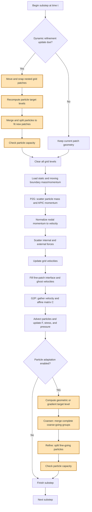
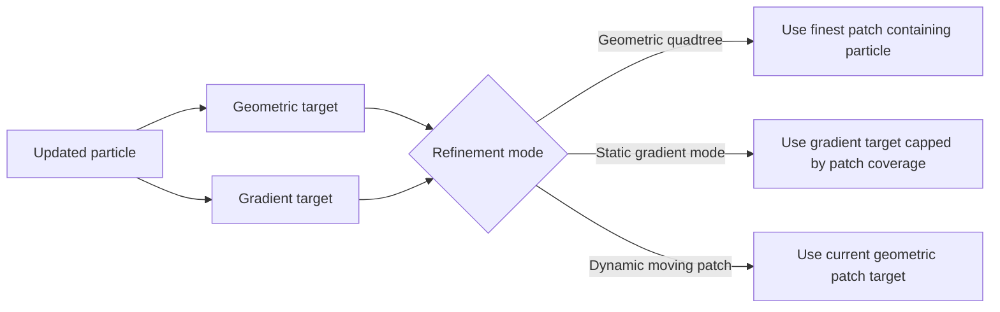

# MPM Algorithm Steps

## Adaptive MPM substep



The orange nodes are the adaptive-refinement operations.

## Where refinement occurs

There are two adaptation points:

1. **Before P2G, only when a dynamic refinement window moves.**
   The grid patches are moved first, then particles are adapted immediately so that the upcoming P2G uses levels supported by the new patch geometry.
2. **After G2P in every normal adaptive substep.**
   G2P first produces the updated particle position and APIC affine matrix `C`. Those values determine the new target level. Merge/split then prepares particles for the **next** substep; newly created particles do not participate in the P2G that already occurred.

The executed ordering is in [`solver/adaptive_engine.py`](solver/adaptive_engine.py), method `AdaptiveMPMSolver2D.step()`.

## Step-by-step state transfer

| Order | Operation | Input state | Output state |
|---:|---|---|---|
| 1 | Optional dynamic regrid | Current patch positions and particles | Shifted, nested patches and adapted particle levels |
| 2 | Clear grid | Old nodal fields | Zero nodal mass, momentum, velocity, and force |
| 3 | Load boundaries | Wall geometry and motion | Boundary virtual mass and momentum |
| 4 | P2G | Particle `x`, `v`, `C`, and mass | Nodal mass and momentum on each active level |
| 5 | Normalize momentum | Nodal mass and momentum | Nodal velocity |
| 6 | Force scatter | Particle mass, volume, and stress | Nodal internal and external force |
| 7 | Grid update | Nodal velocity, mass, and force | Updated nodal velocity |
| 8 | Fine-interface fill | Parent-level velocity | Fine ghost/interface velocity |
| 9 | G2P | Updated nodal velocity | Particle `v`, `C`, `x`, `F`, stress, and pressure |
| 10 | Target selection | Updated particle position and `C` | Requested AMR level |
| 11 | Merge | Complete coarse-going particle groups | Fewer conservative coarse particles |
| 12 | Split | Fine-going particles whose children fit | Four children per 2-D split |
| 13 | Capacity check | Active particle count | Success or explicit overflow error |

## Target-level selection



- **Geometric target:** the finest nested patch containing the particle position.
- **Gradient target:** based on the level-scaled APIC velocity variation

  \[
  \eta_p = \lVert C_p \rVert\,\Delta x_{\ell_p}.
  \]

  Increasing thresholds select levels 0, 1, or 2.

## Merge and split ordering

Particle adaptation always performs **merge before split**:

```text
updated particles
    -> merge complete groups moving to coarser levels
    -> split particles moving to finer levels
    -> compact active storage
```

### Conservative merge

A merge is accepted only when:

- the bin contains at least the configured minimum number of particles;
- every particle in the bin is moving to the same coarser target;
- their combined mass equals one native particle mass at that target level.

Mass, linear momentum, position, affine state, deformation, stress, pressure, and material state are combined using mass- or volume-weighted averages.

### Two-dimensional split

One parent produces four children. Each child receives:

\[
m_c = \frac{m_p}{4}, \qquad V_c^0 = \frac{V_p^0}{4},
\]

with symmetric offsets and APIC-consistent velocity

\[
v_c = v_p + C_p\,(x_c-x_p).
\]

The split waits until all four child centers fit inside the next-level patch. This avoids partial two-child refinement at an interface.

The implementation is in [`core/adaptive_particles.py`](core/adaptive_particles.py).

## Important timing consequence

```text
P2G/G2P at substep n
    -> decide refinement from the updated particle state
    -> merge/split
    -> refined particles first participate in P2G at substep n + 1
```

Thus refinement is a **post-G2P preparation for the next MPM transfer**, except when a moving patch forces a pre-P2G regrid.

## `three_blocks` gradient benchmark exception

The gradient variant keeps the physical block motion rigid. It calls `step(..., adapt_particles=False)`, installs a controlled affine `C` refinement signal, computes gradient targets, and then invokes particle adaptation. The signal is released before the end of the run to reserve a rigid-motion coarsening phase. This isolates gradient-AMR behavior from free-surface and penalty-boundary artifacts while preserving the same main ordering: **G2P first, refinement second**.
